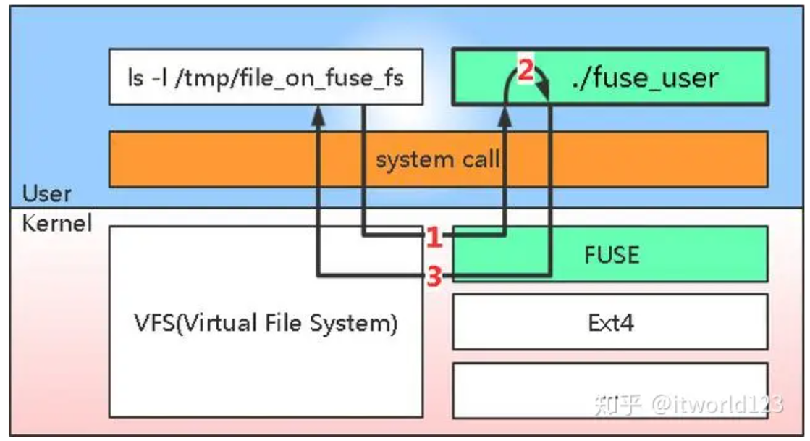
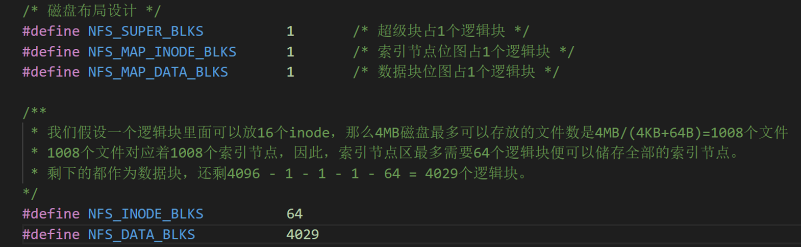
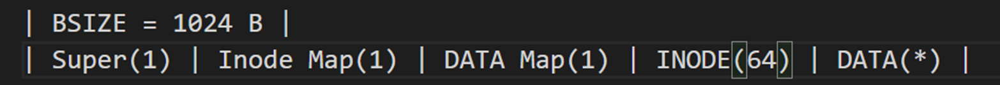
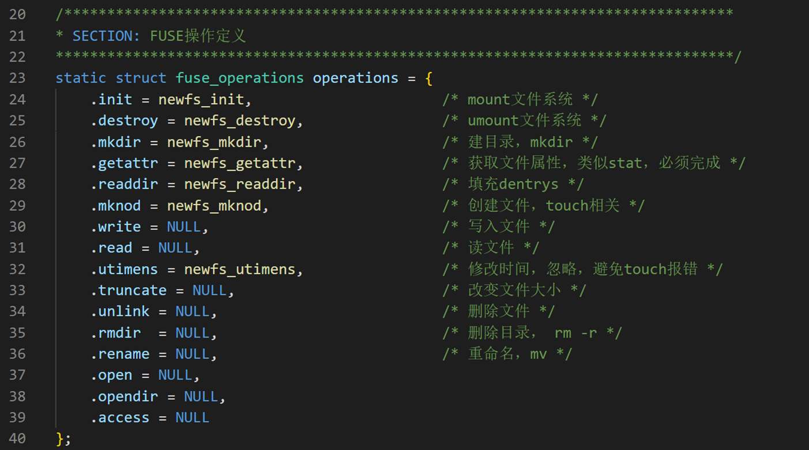
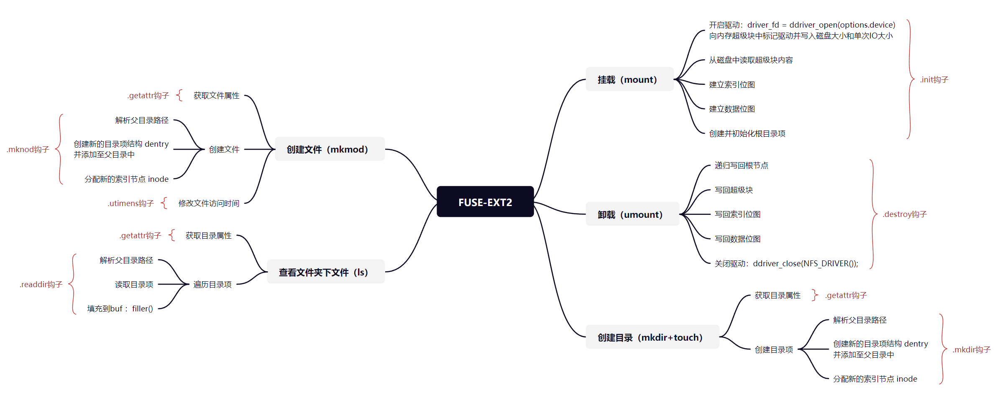

# 基于FUSE的青春版EXT2文件系统

> 本readme节选自实验报告

本实验基于FUSE架构，实现具有超级块、数据位图、索引位图等主要结构的EXT2文件系统，并具备**挂载、卸载、创建文件、创建文件夹、查看文件夹下文件**的功能。核心代码在fs/newfs 下，参考 fs/simplefs实现。

## EXT2系统

EXT2是GNU/Linux系统中标准的文件系统，其特点是存取文件的性能较好，对于中小型的文件更显示其优势。常用于磁盘设备的访问。EXT2的系统规范将磁盘盘块组织为超级块、（组描述符）、位图、索引结点、数据块。本实验需要构造一个在4MB磁盘下的文件系统，包括结构布局在磁盘、内存中不同的架构。

## FUSE架构

FUSE全称为Filesystem in Userspace，即运行在用户空间上的文件系统，是一种实现在用户态、由应用程序开发者为迎合用户空间需求而专门设计的文件系统。这种机制支持了应用程序开发者提供具有各式各样特性的文件系统，具有很高的灵活性。

FUSE实现了一个对文件系统访问的回调。FUSE分为内核态的模块和用户态的库两部分。其中用户态的库为程序开发提供接口，也是我们实际开发时用的接口，我们通过这些接口将请求处理功能注册到FUSE中。内核态模块是具体的数据流程的功能实现，它截获文件的访问请求，然后调用用户态注册的函数进行处理。

因此，要接入FUSE框架，就需要**通过一系列钩子函数（函数指针）来完成对应操作**，此部分我们将在后面详细介绍。

## DDRIVER虚拟磁盘驱动

本次实验在用户态下模拟了一个容量为4MB的磁盘 ，并实现了对这个虚拟磁盘进行操作的 DDRIVER驱动。 虚拟磁盘是通过一个普通的数据文件来充当，这个数据文件的路径位于 ~/ddriver 。我们封装了一层DDRIVER驱动，其原理是单次读取、写入这个数据文件时会按照固定的大小512B进行读取和写入，也就是IO大小为512B ，从而来模拟达到磁盘操作。EXT2文件系统的逻辑块大小为1024B，也就是两个IO单位。

## **文件系统布局设计**

本实验中，简化后的EXT2文件系统的基本布局如下所示：

> 在确定磁盘布局中各部分大小时，我们可以进行简单估算：由于磁盘容量为4MB，逻辑块大小为1024B，那么逻辑块数应该是4MB / 1024B = 4096。如果采用直接索引，假设每个文件最多直接索引4个逻辑块来填写文件数据，也就是每个文件数据上限是4* 1024B = 4KB；同时假设一个逻辑块存储可以存储16个文件的索引节点，则维护一个文件所需要的存储容量是4KB + 64B。那么4MB磁盘，最多可以存放的文件数是4MB / (4KB + 64B) = 1008。

系统各部分功能及大小如下：

- **超级块**：包含整个文件系统和磁盘布局的总体信息，占用1个逻辑块（1024B）。

- **索引节点位图**：记录索引节点表的使用情况，用1个比特记录某一个索引节点是否被使用。由于上述文件系统最多支持1008个文件维护，一个逻辑块（1024B）的位图可以管理1024 * 8 = 8192个索引节点，因此索引节点位图仅占用1个逻辑块（1024B）便足够。

- **数据块位图**：记录数据块的使用情况， 用1个比特记录某一个数据块是否被占用。由索引节点位图可知，数据块位图只占用1个逻辑块（1024B）便足够。

- **索引节点**：记录着文件的元数据，每个文件都与一个inode对应。但一个inode可能对应多个文件（硬链接）。由于假设一个逻辑块存储可以存储16个文件的索引节点，因此1008个文件最多需要64个逻辑块便可以被全部存储。

- **数据块**：记录文件内容，数据块通常会被inode通过直接索引或者间接索引的方式找到（间接索引本次实验不做考虑）。磁盘中的剩余空间均作为数据块，还剩4096 - 1 - 1 - 1 - 64 = 4029个逻辑块。

  

由此，可以填写include/fs.layout文件中的布局如下：

## **钩子函数（函数指针）**

钩子函数（函数指针），是一系列函数的抽象，帮助我们接入FUSE框架。我们定义基于FUSE的文件系统支持的操作函数，填在结构体struct fuse_operations operations中：

## **总体设计**

## 实现功能

本系统实现的功能有：

-  mount：挂载文件系统
-  umount：卸载文件系统
-  ls：查看文件夹下的所有文件
-  touch：新建文件
-  mkdir：新建目录